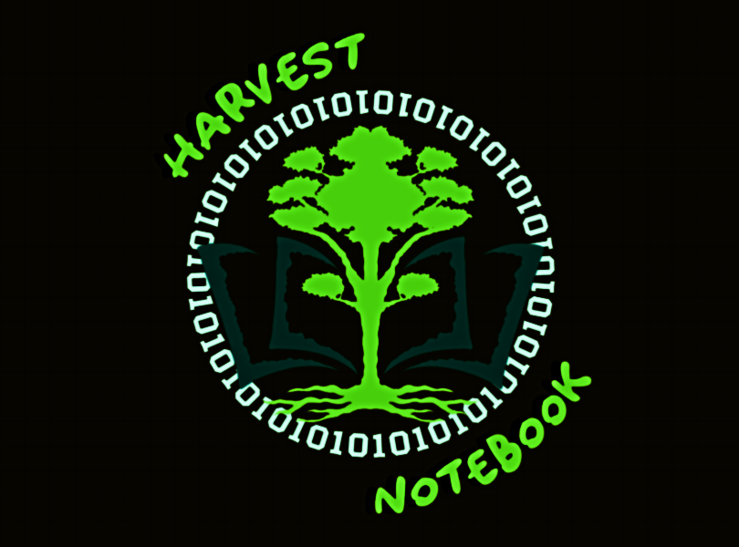

<!--=== === === === === === === === === -->

<!--=== === === === === === === === === -->

# Harvest Notebook (v0.1)

* *Developed by: David Blessent*
* *Published by: Almond House Publishing, LLC.*
* *Available at: https://github.com/almondhouse27/harvest-notebook*

<!--=== === === === === === === === === -->

## Description

A modular and interactive web scraper designed for flexibility and scalability, *Harvest Notebook* allows users to input a list of URLs, check robots.txt files for permissions, scrape data from websites, and generate a suite of comprehensive reports with the click of a button. Reports include page specifications, extracted data, and diagnostics of the scraping process. Built with a Jupyter Notebook interface for user interactivity and Python libraries for robust core functionality and analytics.

<!--=== === === === === === === === === -->

## Requirements

The following are required to run *Harvest Notebook*:

* *Jupyter Notebooks*
* *Python >= 3.12*
* *Python Libraries\**

\*The Python libraries required are specified in `requirements.txt`. 

Note: There is a cell in the 'Notebook Setup' section of Harvest Notebook that calls the `install_requirements()` function from the `config.py` file. That functions handles the installation of the required libraries.

<!--=== === === === === === === === === -->

## What Harvest Notebook Does

<!--=== === === === === === === === === -->

## How To Use Harvest Notebook

